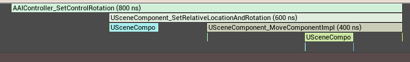

# 2024-12-31 Trace分析

> 本次Trace的绝对时间数据有问题, 并不是标准测试环境的消耗时间. 本次只看时间占Tick百分比. *(% of Root: **EngineTick**)*
## WorldTick

### NavigationSystem

- 总览: 整体占比偏小. 低优先级处理,可先处理更大块严重的问题
- 占比: **0.71%**
- 问题: Trace不完整, 具体里面干了什么并不知道
- 

### RVOWorldSubSystem

- 总览: 需要占用一定的时间. 内部执行的Trace有部分未知的异常数据, 猜测可能是避障的复杂环境不一样导致的. 可以新增Trace确认下看是否有优化的空间.
- 占比: 2.47%
- 问题: Trace不完整. 漏掉了部分异常的Trace.
- 

### ProcessLevel-1

- 总览: 主要的Tick逻辑环节
- 占比: **89.18%**
- 问题: 
- 

#### StartFrame

- 总览: 主Tick环节的帧首,有挺大的固定消耗
- 占比: **5.4%**
- 问题: Trace内容不完整
- 
- 

#### RunTickGroup

##### PrePhysics

- 概览: 执行物理前的Tick组, 占比时间为最大头的, 主要执行AbilitySystemComponent_Advance & Movement相关内容
- 占比: **54%**
- Callees
  - 
- MoveComponent
  - 

- AIController_SetControlRotation
  - 

- SkinnedMeshComponent
  - 

- **CharacterMovementComponent**
  - 
  - 
  - 

- **AbilitySystemComponent_Advance** 
  - 

- ABuildingPawn_Tick
  - 

##### StartPhysics

- 概览: 开始物理的Tick组, 占比较小
- 占比: **1.71%**
- 问题: Trace不全, 只能看到零星的Chaos的Trace\
- 

##### DuringPhysics

- 概览:物理执行Tick组
- 占比:**26.22%**
- Callees
  - 
  - 前未知领域,零星看到一些PathFollowing的内容. 占比大概三分之一
    - 
  - BehaviorTreeComponent
    - 在未发生战斗情况下,大部分消耗来自于Move时调用到转身GA. 技能内部最大的地方为一个全局的技能激活事件
    - 
  - 后未知领域, 占比稍小,  只能看到有ActorComponentTick, 看不到任何信息
    - 

##### EndPhysics

- 占比: 0.17%

##### PostPhysics

- 占比: 0.01%

##### *PostUpdateWork*

- *占比:  0%*

##### *LastDemotable*

- *占比: 0%*

#### *TimerManagerTick*

- 占比: 0.02%

#### *World TickObjects Tick*

- 概览: 大部分自己实现TickableObject的对象. Trace不完整

- 占比: 1.19%

  - AI感知系统的Tick位于此处
  - 

#### *UpdateStreamingState*

- 占比: 0.01%
- 

### NetBroadcastTick
- 占比: 0%
- >没有客户端机器人

## GameEngineTick
### ULogicSystem_TickComponent

- 总览: 业务逻辑的Tick入口, 调用各个Components的Tick
- 占比: 3.41%
- 问题: 
  - Trace信息不准确, 大部ComponentTick没有Trace
  - 
  - 在LogicSystemTick前 有一个LogicSystem_EndTickComponent的调用, 是在WorldTickEnd中调用的.  LogicSystem的Tick是划分在了GameEngineTick 整体比WorldTick靠后. 原因可能是USocContext作为EngineSubSystem, 实现TickableObject时不方便返回World, 或本身就不应依赖World.
  - 

## 空白

- 帧尾有一片空白
- 