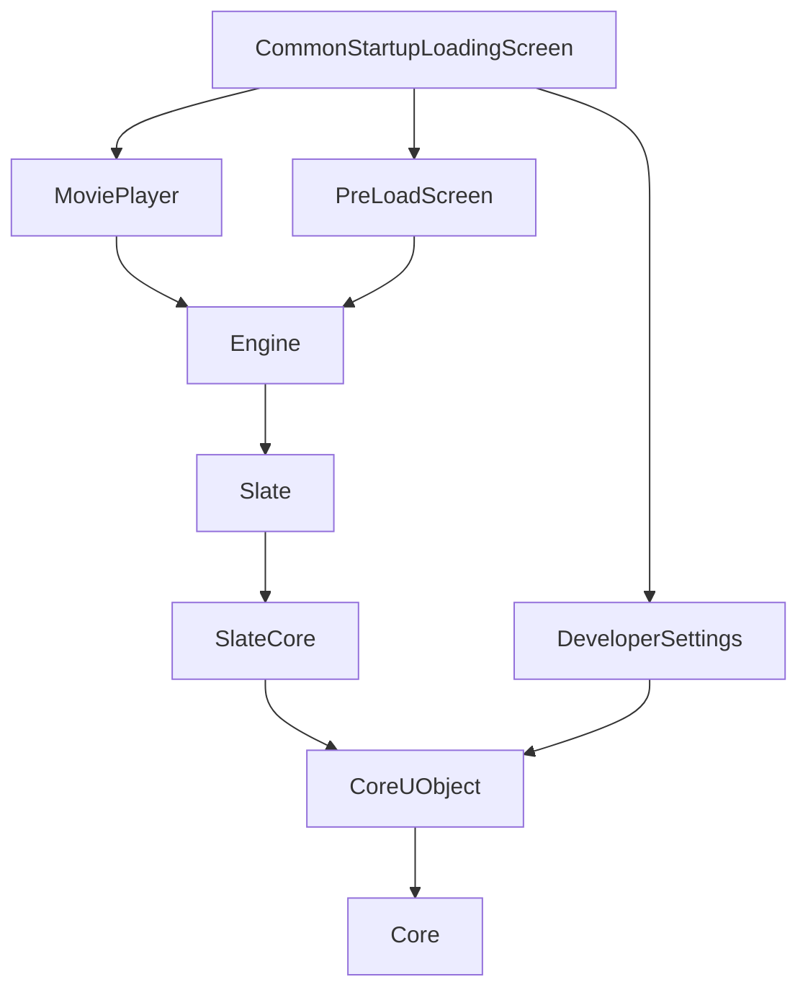
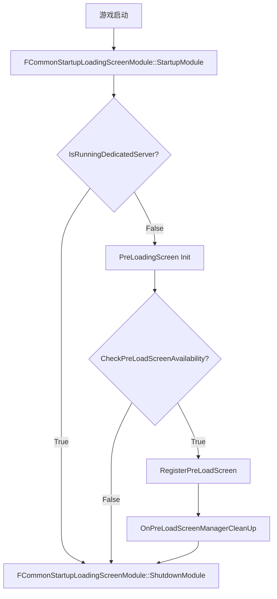

# Loading调研

[TOC]

---

## 1 概览

- **插件名称:**  `CommonLoadingScreen`
- **模块**
  - `CommonLoadingScreen`
  - `CommonStartupLoadingScreen`
- **功能描述:**
> 加载屏幕管理器处理项目指定的加载屏幕UI的创建和显示 .该模块主要用于在游戏加载阶段显示过渡画面或加载动画，提供一个灵活的、可自定义的加载屏幕解决方案。

- **核心功能**
	-  TODO

---

## 2 文件结构

CommonLoadingScreen/
├── Source/
│   ├── CommonLoadingScreen/
│   │   ├── Private/                         # 私有实现文件
│   │   │   ├── CommonLoadingScreenModule.cpp
│   │   │   ├── CommonLoadingScreenSettings.cpp
│   │   │   ├── CommonLoadingScreenSettings.h
│   │   │   ├── LoadingScreenManager.cpp
│   │   ├── Public/                          # 公共头文件
│   │   │   ├── LoadingProcessInterface.h
│   │   │   ├── LoadingProcessTask.cpp
│   │   │   ├── LoadingProcessTask.h
│   │   │   ├── LoadingScreenManager.h
│   │   ├── CommonLoadingScreen.Build.cs     # 构建配置
│   ├── CommonStartupLoadingScreen/          # 启动加载屏幕模块
│   │   ├── Private/
│   │   │   ├── CommonPreLoadScreen.cpp
│   │   │   ├── CommonPreLoadScreen.h
│   │   │   ├── CommonStartupLoadingScreen.cpp
│   │   │   ├── SCommonPreLoadScreenWidget.cpp
│   │   │   ├── SCommonPreLoadScreenWidget.h
│   │   ├── CommonStartupLoadingScreen.Build.cs
├── CommonLoadingScreen.uplugin              # 插件配置文件

---

## 3 CommonStartupLoadingScreen Module

### 3.1  CommonStartupLoadingScreen.Build.cs

#### 3.1.1 源码

``` c#
		PublicDependencyModuleNames.AddRange(
			new string[]
			{
				"Core",
				// ... add other public dependencies that you statically link with here ...
			}
			);
			
		PrivateDependencyModuleNames.AddRange(
			new string[]
			{
				"CoreUObject",
				"Engine",
				"Slate",
				"SlateCore",
				"MoviePlayer",
				"PreLoadScreen",
				"DeveloperSettings"
			}
			);
```
#### 3.1.2 关键依赖模块

1. MoviePlayer
2. PreLoadScreen
3. DeveloperSettings

#### 3.1.3 模块依赖图



### 3.2 CommonPreLoadScreen

#### 3.2.1 基类

[^FPreLoadScreenBase]: 所属模块PreLoadScreen

#### 3.2.2 成员

[^TSharedPtr EngineLoadingWidget; ]: Loading的UI

#### 3.2.3 函数

- Init
- GetPreLoadScreenType
- GetWidget

#### 3.2.4 流程图


#### 3.2.5 时序图

#### 3.2.6 类图

#### 3.2.7 数据流图

---

## 4 CommonLoadingScreen Module

