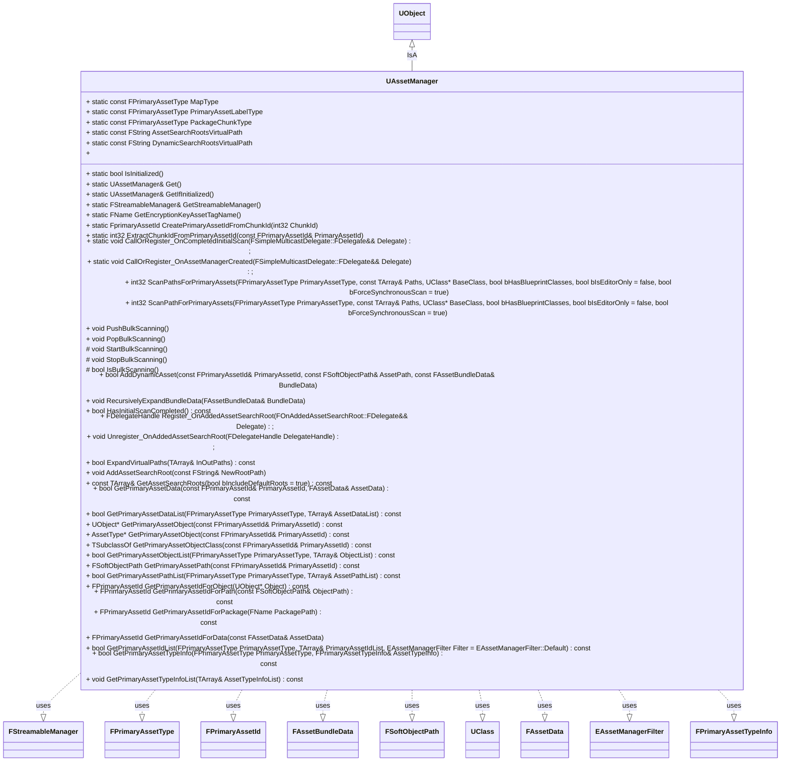

# SocAssetManager

## Actor 类
### 建筑类

1. ABuildingPawn
2. AFightBuildingPawn
3. ABuildingBaseActor
4. ABuildingActor
5. AFreeBuildingActor
6. AHomeBuildingActor

#### 继承关系图

#### 业务需求

## 设想

1. 统一配置方式
2. 注入生命周期中
3. 加载完资产后对应的实例才正式激活
4. 激活后方便使用
5. 资产&配置检查 
6. 模块可自定义在什么时机加载,  加载多少资源
7. 继承AssetManager实现. 
   1. AssetMananger的好处

## AssetManager

### 前言

> 考虑AssetManager的原因, 我习惯做一个功能的时候会优先考虑引擎有没有满足我需求模块或类似的模块解决我的问题.  类似模块可以理解为有这个系统但是不太满足我们的需求.我会基于引擎模块重载进行扩展.  引擎中完全没有对应的概念才会开启一个全新的模块进行开发.

### 类图

### 数据图

### 时序图

### 流程图

### 依赖图

