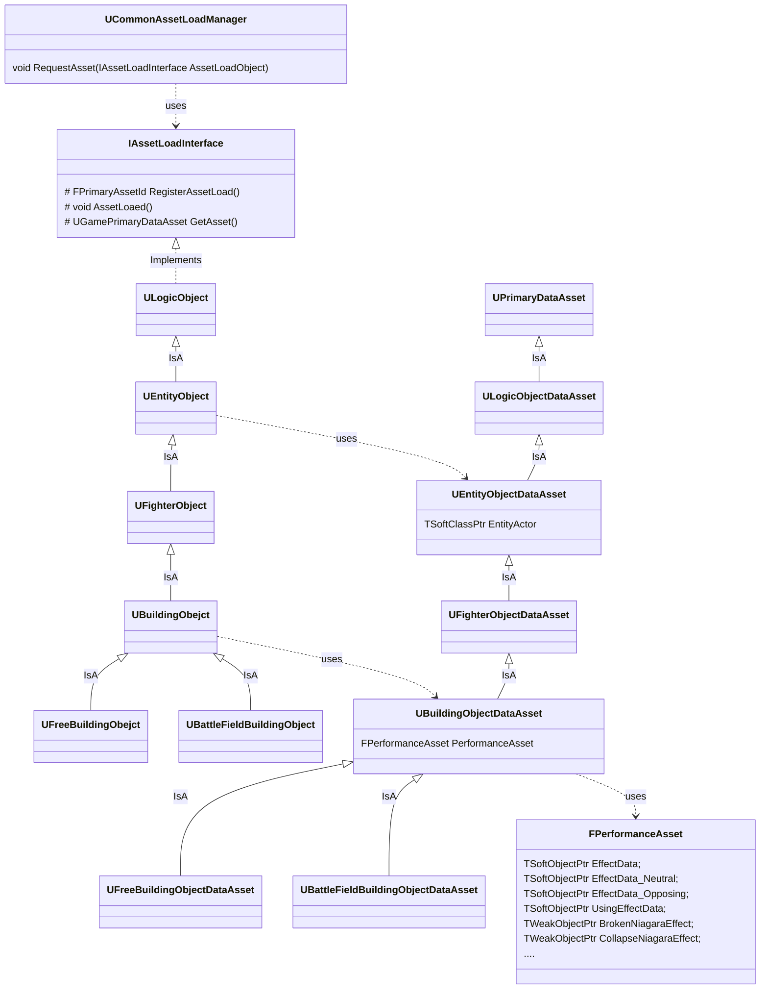
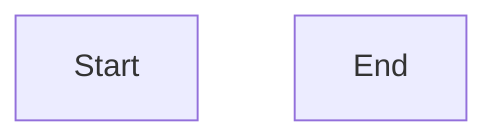

# CommonAssetLoadManager

[TOC]

## 1. 概览

- 功能描述: 

  > ​	通用的资产加载管理器, 提供方便的方式进行Gameplay开发环境下的资产异步加载

- 核心功能
  - CommonAssetLoadManager
  - AssetLoadInterface
  - PrimaryDataAsset

## 2. 类图

## 2. 流程图

